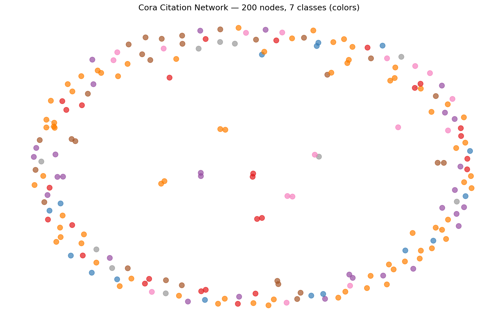
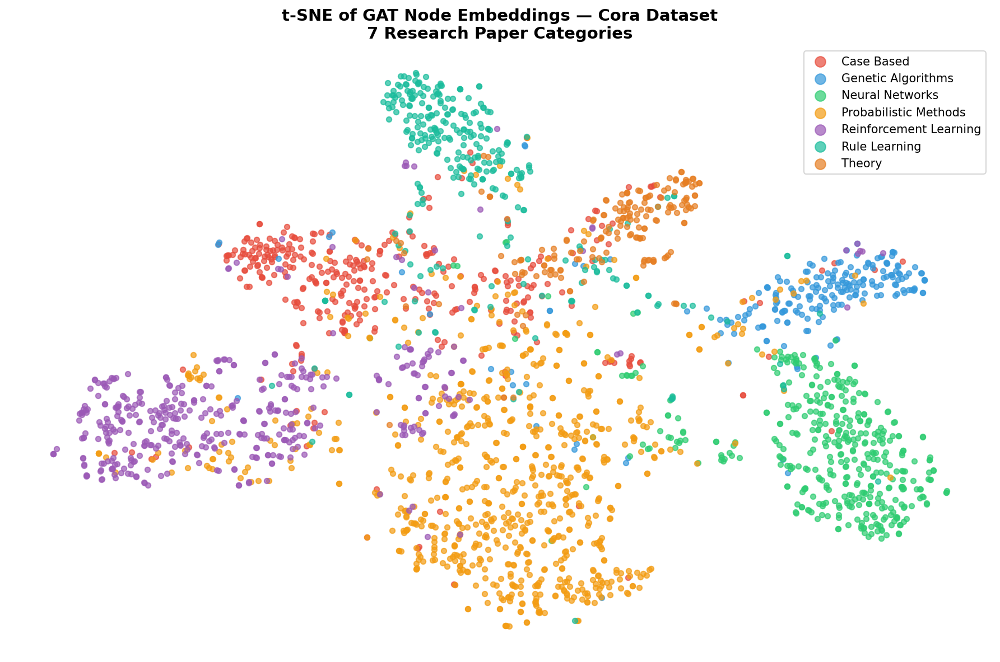
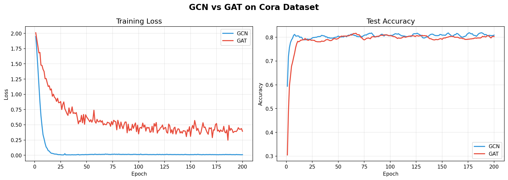

# 🧠 GNN Citation Network Classifier

**Classifying research papers by training Graph Neural Networks on the Cora citation graph**

---

## 📌 Overview

Academic papers don't exist in isolation — they cite each other, forming a graph. This project trains two Graph Neural Networks to classify 2,708 research papers into 7 categories by learning from both paper content and citation structure.

**The key question:** How much does graph structure itself contribute?

**Answer: +26% accuracy improvement over using text features alone.**

---

## 🏆 Results

| Model | Test Accuracy | vs Baseline |
|:------|:------------:|:-----------:|
| Logistic Regression (no graph) | 57.0% | — |
| GCN — Graph Convolutional Network | 81.0% | +24% |
| GAT — Graph Attention Network | **83.0%** | **+26%** |

> **Why GAT beats GCN:** Academic citation graphs have heterogeneous neighborhoods — a reinforcement learning paper may cite both foundational RL papers and unrelated methodology papers. GAT's attention mechanism learns to down-weight irrelevant citations, which uniform GCN averaging cannot do.

---

## 📊 Visualizations

### Cora Citation Network — 200 nodes, 7 classes

### t-SNE of Learned Node Embeddings
*7 geometrically separated clusters confirm the model learned meaningful representations*

### Training Curves — GCN vs GAT

---

## 🧩 Architecture

**GCN**

Input (1433) → GCNConv → ReLU + Dropout → GCNConv → LogSoftmax → 7 classes

**GAT**

Input (1433) → GATConv (8 heads × 8 features) → ELU + Dropout → GATConv → LogSoftmax → 7 classes

---

## 📦 Dataset — Cora

| Property | Value |
|:---------|------:|
| Nodes (papers) | 2,708 |
| Edges (citations) | 5,429 |
| Node features | 1,433 |
| Classes | 7 |
| Training nodes | 140 |
| Test nodes | 1,000 |

**7 Classes:** Case Based · Genetic Algorithms · Neural Networks · Probabilistic Methods · Reinforcement Learning · Rule Learning · Theory

---

## 🚀 Run It Yourself

**Step 1 — Open the notebook in Colab** (click the badge above)

**Step 2 — Install PyTorch Geometric**

    !pip install torch-geometric

**Step 3 — Run all cells** — dataset downloads automatically, no Kaggle needed

---

## 🛠️ Tech Stack

`PyTorch` · `PyTorch Geometric` · `Google Colab T4 GPU` · `NetworkX` · `scikit-learn` · `Matplotlib`
